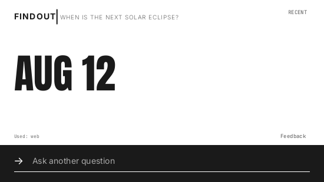
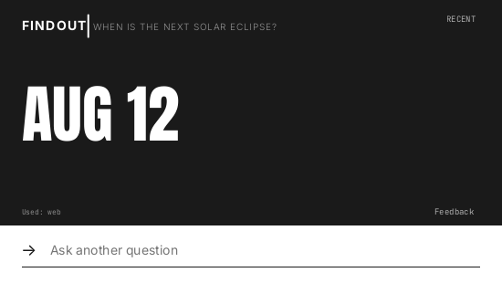

# Monolith desktop UI

Monolith is the production desktop UI from v0.1.6 onward. It starts in light
mode; uncheck **Light theme** in the tray menu for the dark variant. Both themes
share the layout, motion and interactions, and the choice lasts for the running
session. The app uses native Slint with bundled fonts, without a browser or
runtime font downloads.

The [v0.1.5 UI](../archive/desktop-v0.1.5/) is preserved separately for reference.
Normal release builds retain installation, autostart and automatic updates.
The optional `local-trial` feature only changes packaging and lifecycle behavior;
it uses the same UI as production.

## Themes





## Optional local preview

1. Quit your other FindOut instance from its tray menu; both versions use
   **Super+Space** on Linux.
2. Open **FindOut Monolith** from your application launcher.
3. Ask questions as usual. If you already activated the production desktop
   client, the preview uses that activation.

The executable is `target/monolith/findout-monolith`. It connects to
`https://findout-backend.vercel.app`. Its queries use your normal allowance.
The preview shares production history and keychain credentials with the regular
client. It adds optional timestamps to history; older saved conversations remain
readable, and the regular client can still read the updated files.

This is a separate portable build: it does not replace the installed executable,
change autostart, or check for automatic updates. Nothing needs to be pushed to
GitHub to use it. To switch back, quit Monolith and open your regular FindOut.

## Interactions

- Sending a question flows the underline along an invisible curved channel
  beneath FINDOUT, then upward into a vertical divider. Its tail follows its
  leading end around the bend. The question slides out from behind it, easing
  to a stop. Follow-ups repeat the
  question reveal.
- The input arrow moves six pixels each way over a slow 4.4-second cycle. Motion
  stops while hidden, busy, or browsing Recent.
- Short answers that fit the line use Anton at 69px. Longer answers use Inter at
  17px and scroll.
  Answers have no insertion caret. Select text normally; right-click the answer
  to copy it. Ctrl+C copies a text
  selection. The response text is preserved, including its capitalization.
- **Recent** opens the five saved conversations inside the same popup. Click a
  row to expand or collapse its answers. Long threads scroll within the expanded
  row; **Continue thread** restores the latest answer and follow-up context.
- **Back** returns to the current question without changing the draft. Escape
  returns from Recent; otherwise it hides FindOut.
- **Feedback** in the footer opens the feedback window directly.
- **UPDATE vX.Y.Z** appears below Recent when a production update is available.
  After updating, **WHAT’S NEW** opens the release notes.
- **Light theme** in the tray menu switches between the default white answer
  area with dark input strip and the original charcoal answer area with white
  input strip. Recent, selections, tooltips and dialogs follow the theme.
- **Reduce motion** is a checkable item in the tray menu. The other former
  three-dot menu actions have been removed from the UI. Clipboard image paste
  still uses Ctrl+V (Cmd+V on macOS); click **IMG ×** to remove an attachment.
  On Linux, copying one PNG/JPEG file in Thunar and pasting attaches its contents
  without inserting the file path.
- The footer shows actual web/image usage and server quota or error messages.
  Hover a status message to read its full text. Calculator usage is not fabricated:
  the current client response contract only provides web and image flags.
- Older conversations without timestamps show a blank age. New answers record
  their time locally. Reduce motion applies for the running session.

## Rebuild the preview on Linux

```sh
python3 scripts/setup-monolith.py
```

This builds the `local-trial` feature, copies the result atomically into
`target/monolith/`, and creates
`~/.local/share/applications/findout-monolith.desktop` (respecting
`XDG_DATA_HOME`). Restart the preview after rebuilding it.

The source is in `src/monolith.slint`; the existing Rust request, clipboard,
keychain and conversation code remains in `src/main.rs`. Bundled font licenses
are in `assets/fonts/` and included in every executable; run
`findout-client --licenses` to read them. The font files come from the Google Fonts repository:
[Anton](https://github.com/google/fonts/tree/main/ofl/anton),
[Inter](https://github.com/google/fonts/tree/main/ofl/inter), and
[JetBrains Mono](https://github.com/google/fonts/tree/main/ofl/jetbrainsmono).

## Checks

```sh
cargo test --locked
# Each GUI check needs its own process and disposable display.
dbus-run-session --config-file=tests/dbus-session.conf -- xvfb-run -a \
  env -u WAYLAND_DISPLAY -u XDG_RUNTIME_DIR SLINT_SCALE_FACTOR=1 \
  cargo test --locked monolith_ui -- --ignored
# Repeat the last command with scrolling_ui, clipboard_copy, or clipboard_paste_ui instead.
```

Set `FINDOUT_UI_DARK=1` and a separate `FINDOUT_UI_CAPTURE_DIR` to capture
the same GUI checks in the dark variant.

`monolith_ui` exercises caret-free selection, right-click copying, Recent
toggling, animated expansion/collapse, Continue thread, the direct Feedback
action, update controls, and the tray theme and motion toggles with synthetic conversations. It writes
screenshots to `/tmp/findout-monolith` or `FINDOUT_UI_CAPTURE_DIR`.
The scrolling test checks long input, answer selection, wheel scrolling and
PageDown. The clipboard test reads the copied Unicode text from a separate X11
process. GUI checks use a private D-Bus session with service activation disabled;
they do not access the desktop keychain or backend.
